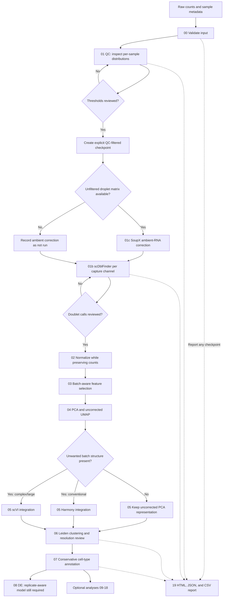

# Customised scRNA-seq Workflow

A command-line learning workflow for quality control, preprocessing, integration, annotation, and downstream single-cell RNA-seq analysis.

The repository has a supported core path and a set of optional research modules. It is designed to be auditable and adaptable; dataset-specific thresholds and biological decisions still require analyst review.

## Features

- AnnData input and metadata validation
- sample-aware QC with retained pass/fail reasons and threshold tables
- `scDblFinder` doublet detection per capture channel
- optional SoupX ambient-RNA correction using an unfiltered droplet matrix
- normalization, feature selection, PCA, UMAP, and clustering
- optional Harmony or scVI batch correction
- annotation and downstream analysis examples
- a portable HTML/JSON analysis report
- separate core and advanced Conda environments

## Workflow diagram



The decision diamonds are deliberate. Ambient correction cannot run correctly without an unfiltered droplet matrix, and batch correction should not be applied merely because multiple samples exist.

## Quick installation

Requirements: Linux or macOS, or Windows through WSL2; Conda/Miniforge/Mambaforge; at least 16 GB RAM for a small-to-medium dataset.

```bash
git clone https://github.com/Paulyang5049/Customised-scRNA-Workflow.git
cd Customised-scRNA-Workflow
conda env create -f environment.yml
conda activate scrna-workflow
python scripts/00_validate_input.py --help
```

Mamba can resolve the same environment faster:

```bash
mamba env create -f environment.yml
conda activate scrna-workflow
```

Use the larger environment only for scVI, velocity, automated annotation, and other advanced modules:

```bash
conda env create -f environment-advanced.yml
conda activate scrna-workflow-advanced
```

The core and advanced Conda definitions have been solver-checked on macOS ARM64. Exact platform builds may differ on Linux and Intel systems.

## Input data and metadata

The primary input is an AnnData `.h5ad` file with cells in rows and genes in columns. Cell and gene names must be unique. Raw, non-negative, integer-like UMI counts should be stored in `layers["counts"]`; `.X` is accepted as the initial count matrix when that layer does not yet exist.

Recommended `.obs` columns:

| Column | Meaning | Used by |
|---|---|---|
| `sample` | Biological sample or capture channel | QC, scDblFinder, pseudobulk |
| `batch` | Unwanted technical batch | Harmony/scVI |
| `condition` | Biological condition of interest | Differential and compositional analysis |
| `donor` | Biological donor | Replicate-aware models |
| `cell_type` | Reviewed final annotation | Cell-type-specific downstream analysis |

Do not use the experimental condition as the batch key. Correcting the variable being tested can erase the biological signal.

## Core workflow: detailed explanation

### Step 00 — Validate the input

[`scripts/00_validate_input.py`](scripts/00_validate_input.py) checks dimensions, unique identifiers, required metadata, sample sizes, and whether the selected matrix contains non-negative integer-like counts. It writes a machine-readable JSON report and exits with status 2 when a blocking problem is found.

```bash
python scripts/00_validate_input.py \
  --input data/raw_counts.h5ad \
  --sample-key sample \
  --required-obs sample,batch,condition \
  --report results/00_validation.json
```

### Step 01 — Quality control

[`scripts/01_quality_control.py`](scripts/01_quality_control.py) calculates total counts, detected genes, mitochondrial percentage, ribosomal percentage, and hemoglobin percentage. Filtering decisions use the standard count, gene, and mitochondrial metrics and are calculated separately within each sample using robust MAD limits.

The first run should retain every barcode. It adds `passes_qc`, individual reason flags, and `qc_reason`, writes per-sample thresholds to CSV, and draws those thresholds on the distribution plots.

```bash
python scripts/01_quality_control.py \
  --input data/raw_counts.h5ad \
  --output results/01_qc_review.h5ad \
  --sample-key sample

python scripts/19_generate_report.py \
  --input results/01_qc_review.h5ad \
  --output reports/qc_review.html
```

After reviewing the plots, create a separate filtered checkpoint:

```bash
python scripts/01_quality_control.py \
  --input data/raw_counts.h5ad \
  --output results/01_qc_filtered.h5ad \
  --sample-key sample \
  --filter-failed
```

There is no universal mitochondrial cutoff. `--max-pct-mt` should only be supplied when tissue biology and the observed distributions justify it.

### Step 01c — Ambient-RNA correction

[`scripts/01c_ambient_rna_correction.py`](scripts/01c_ambient_rna_correction.py) runs SoupX using both the filtered cell matrix and the unfiltered droplet matrix. If no cluster labels are supplied, it creates a preliminary clustering strictly for contamination estimation.

```bash
python scripts/01c_ambient_rna_correction.py \
  --input results/01_qc_filtered.h5ad \
  --raw-droplets data/raw_unfiltered_droplets.h5ad \
  --output results/01c_soupx.h5ad \
  --set-active-counts
```

Corrected counts are stored in `layers["soupx_counts"]`. When `--set-active-counts` is used, the pre-correction matrix is preserved in `layers["counts_pre_ambient"]` and corrected counts become the downstream `counts` layer. The per-cell contamination fraction is stored in `.obs`.

### Step 01b — Doublet detection

[`scripts/01b_doublet_detection.py`](scripts/01b_doublet_detection.py) transfers the sparse count matrix to Bioconductor and calls `scDblFinder` separately for each value of `--sample-key`. It stores the score, class, and technical partition for every barcode.

```bash
python scripts/01b_doublet_detection.py \
  --input results/01c_soupx.h5ad \
  --output results/01b_doublet_review.h5ad \
  --sample-key sample
```

The default behavior flags rather than removes doublets. Review the per-sample rates and their positions in the embedding, then rerun with `--filter-doublets` if a singlet-only checkpoint is appropriate. The script stops if R or `scDblFinder` is unavailable; it does not silently substitute a different caller.

### Step 02 — Normalization

[`scripts/02_normalization.py`](scripts/02_normalization.py) creates normalized expression layers while retaining raw counts. Shifted-log normalization is suitable for conventional visualization and PCA; scran size factors and Pearson residuals are alternative representations with different assumptions.

Do not overwrite the count layer with log-normalized values. Select one primary representation for a particular analysis rather than combining normalized matrices.

```bash
python scripts/02_normalization.py \
  --input results/01b_doublet_review.h5ad \
  --output results/02_normalized.h5ad
```

### Step 03 — Feature selection

[`scripts/03_feature_selection.py`](scripts/03_feature_selection.py) identifies genes that carry informative cell-to-cell variation. Highly variable genes should be selected in a batch-aware way when multiple batches are present, while nuisance-dominated genes should be reviewed before they drive an embedding.

The selected mask is stored in `.var`; genes are not permanently deleted from the full result object.

### Step 04 — Dimensionality reduction

[`scripts/04_dimensionality_reduction.py`](scripts/04_dimensionality_reduction.py) computes PCA, a neighbor graph, t-SNE, and UMAP from the selected expression representation. PCA is the analytical representation; UMAP and t-SNE are primarily visualization tools.

Inspect embeddings by sample, batch, QC state, doublet class, and known biological markers before clustering.

### Step 05 — Integration and batch correction

[`scripts/05_data_integration_and_batch_correction.py`](scripts/05_data_integration_and_batch_correction.py) supports four explicit choices:

- `none`: retain the conventional PCA representation;
- `harmony`: adjust PCs for a known technical batch;
- `scvi`: learn a count-based latent representation for larger or more complex designs;
- `auto`: currently selects Harmony when correction is requested.

```bash
python scripts/05_data_integration_and_batch_correction.py \
  --input results/04_dimred.h5ad \
  --output results/05_integrated.h5ad \
  --batch-key batch \
  --method harmony \
  --rationale "Library-preparation day separates otherwise matched donors"
```

The output preserves `X_umap_uncorrected`, `X_umap_integrated`, and `X_integrated`, and makes the selected neighbor graph available to clustering. The report includes a side-by-side batch plot. Analysts must check both batch mixing and preservation of biological structure.

### Step 06 — Clustering

[`scripts/06_clustering.py`](scripts/06_clustering.py) applies Leiden clustering at several resolutions to the selected neighbor graph. Resolution is not a biological truth: compare stability, markers, sample support, and known tissue structure rather than choosing the most visually detailed partition.

```bash
python scripts/06_clustering.py \
  --input results/05_integrated.h5ad \
  --output results/06_clustered.h5ad
```

### Step 07 — Cell-type annotation

[`scripts/07_cell_type_annotation.py`](scripts/07_cell_type_annotation.py) provides PBMC/bone-marrow marker inspection and an optional CellTypist prediction. Automated labels should be treated as hypotheses.

Use a reference matched by species, tissue, assay, and biological state. Save coarse and fine labels, prediction confidence, and an `unknown` or `ambiguous` category rather than forcing every cluster into a precise label. The current built-in marker dictionary is not a generic reference for other tissues.

### Step 08 — Differential expression

[`scripts/08_differential_gene_expression.py`](scripts/08_differential_gene_expression.py) currently provides exploratory cell-level ranking and produces a pseudobulk checkpoint. Condition-level scientific inference should use sums of raw counts per `sample × cell_type`, followed by an explicit edgeR, DESeq2, or limma-voom design with biological replicates.

The existing single-cell Wilcoxon results should not be interpreted as replicate-aware condition tests. A complete edgeR design/contrast implementation remains an important next improvement.

### Step 19 — Automatic reporting

[`scripts/19_generate_report.py`](scripts/19_generate_report.py) can report any checkpoint, not only the final output. It generates a self-contained HTML file, a JSON audit summary, and CSV tables of QC metrics and cell counts.

```bash
python scripts/19_generate_report.py \
  --input results/06_clustered.h5ad \
  --output reports/index.html \
  --summary-json reports/summary.json \
  --figures-dir figures
```

The automatic audit identifies missing raw counts, doublet assessment, ambient-RNA assessment, integration, annotation, or provenance. These warnings assist review but do not replace biological judgment.

## Optional downstream and multimodal modules

These scripts are independent branches. Run only those supported by the assay and study design.

| Step | Script | Purpose and important requirement |
|---|---|---|
| 09 | `09_gene_set_enrichment_analysis.py` | Pathway enrichment from ranked statistics. Prefer signed, replicate-aware DE statistics and report multiple-testing correction. |
| 10 | `10_compositional_analysis.py` | scCODA analysis of cell-type proportions. Requires multiple biological samples and an explicit condition column. |
| 11 | `11_pseudotime_and_trajectories.py` | Diffusion pseudotime. The lineage subset and root state must be biologically justified. |
| 12 | `12_rna_velocity.py` | scVelo using spliced/unspliced layers. Requires velocity-specific QC and validation of kinetic assumptions. |
| 13 | `13_perturbation_modeling.py` | Augur prioritization of perturbation-responsive cell types. Donor and batch confounding must be controlled. |
| 14 | `14_cell_cell_communication.py` | LIANA ligand–receptor inference. Analyze conditions and replicates explicitly; expression alone does not prove signaling. |
| 15 | `15_gene_regulatory_networks.py` | pySCENIC regulon inference. Requires species-matched TF lists and cisTarget databases and substantial memory. |
| 16 | `16_paired_integration.py` | Paired RNA/ADT integration for CITE-seq. Cell barcodes must be shared across modalities. |
| 17 | `17_advanced_integration.py` | TOTALVI, GLUE, or MultiGrate. Each method has modality-specific preprocessing and model requirements. |
| 18 | `18_lineage_tracing.py` | Cassiopeia reconstruction from CRISPR character matrices. RNA expression is not a valid substitute for lineage characters. |

## Output and provenance conventions

- Keep raw or pre-correction counts in a named layer.
- Save major checkpoints rather than overwriting input files.
- Keep matrices sparse; avoid converting whole datasets to dense arrays.
- Store analysis choices under `adata.uns["scrna_workflow"]`.
- Preserve QC, doublet, contamination, annotation confidence, sample, batch, donor, and condition fields in `.obs`.
- Archive the environment file, report, summary tables, figures, and external reference versions with the analysis.

Generated outputs are ignored by Git by default. Large `.h5ad`, `.h5mu`, and `.loom` files should be stored in appropriate data storage rather than normal Git history.

## Testing

Run the unit tests after installation:

```bash
pytest -q
python -m compileall -q scripts
```

The core validation, QC, Harmony integration, clustering handoff, and reporting stages have also been smoke-tested on a synthetic sparse-count AnnData object. Bioconductor wrappers preserve sparse Matrix Market exchange and fail immediately when R is unavailable.

## Further documentation

See [`docs/USER_GUIDE.md`](docs/USER_GUIDE.md) for a compact operational guide, troubleshooting, and copyable commands.

## Attribution

Parts of the workflow and explanatory structure were adapted from the [Single-cell Best Practices](https://www.sc-best-practices.org/) project and the accompanying Heumos et al. review. Please cite the original methods, databases, atlases, and reference resources used in an analysis.
